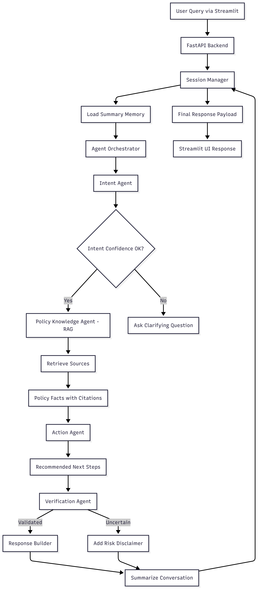

# Civic Copilot

**Civic Copilot** is an AI-powered assistant designed to streamline civic processes, automate information retrieval, and enhance user interactions with government or civic data. The project features a modular backend, a user-friendly frontend, and robust support for retrieval-augmented generation (RAG), large language models (LLMs), and session management.

---

## Table of Contents

- [Features](#features)
- [Architecture](#architecture)
- [Setup & Installation](#setup--installation)
- [Usage](#usage)
- [Project Structure](#project-structure)
- [Testing](#testing)
- [Contributing](#contributing)
- [License](#license)

---


## Features

- **Modular AI Agents**: Intent, action, policy, and verification agents for flexible task orchestration.
- **Retrieval-Augmented Generation (RAG)**: Integrates FAISS-based document retrieval for context-aware responses.
- **Multi-LLM Support**: Hugging Face Inference API implemented. OpenAI and Gemini support are planned (not yet available).
- **Session Management**: Persistent memory and summarization for user sessions.
- **Audit Logging**: Traceable logs for transparency and debugging.
- **Streamlit Frontend**: Simple, interactive UI for end users.

---

## System Architecture

Civic Copilot follows a **layered, explicit architecture** with a clear separation between UI, orchestration, intelligence, and storage.

> The system is intentionally **orchestrated, not autonomous** — every decision path is predictable, debuggable, and auditable.

### High-Level Flow

```
User (Streamlit)
   ↓
FastAPI Backend
   ↓
Session & Memory Manager
   ↓
Agent Orchestrator
   ↓
Intent → Policy (RAG) → Action → Verification
   ↓
Response Builder → UI
```

---


### Detailed Request Lifecycle

*Diagram location: `img/flowchart-civic-copilot.png`*

## Architecture Components (Deep Dive)

### 1. Streamlit Frontend

The Streamlit UI acts as the **interaction layer**:

* Accepts user queries
* Allows LLM provider selection
* Displays:

  * Final response
  * Source citations
  * Confidence indicators
  * Optional reasoning trace (collapsed by default)

---

### 2. API Gateway (FastAPI Backend)

FastAPI serves as the system’s **entry point and traffic controller**:

* Validates requests
* Manages sessions
* Routes execution to the orchestrator
* Returns structured responses to the frontend

---

### 3. Session & Memory Manager

Instead of replaying raw chat history, Civic Copilot uses **summarization-based memory**.

After each interaction:

* Key facts are summarized
* User intent and unresolved issues are stored
* Previous decisions are persisted in structured form

This prevents context explosion and mirrors **real production conversational systems**.

---

### 4. Agent Orchestrator

The orchestrator is the **control plane** of the system.

It:

* Receives structured context from memory
* Determines agent execution order
* Enforces schema-based communication
* Prevents agents from bypassing responsibility boundaries

This explicit orchestration favors **predictability over novelty**.

---

### 5. Agents

Each agent has **one responsibility** and communicates through typed schemas.

#### Intent Agent

* Interprets user intent and domain
* Outputs confidence-scored structured intent
* Triggers clarification if confidence is low

#### Policy / Knowledge Agent (RAG)

* Retrieves official rules, timelines, and documents
* Grounds responses using citations
* Never generates unsupported claims

#### Action Agent

* Converts policy facts into actionable steps
* Suggests escalation paths and next actions
* Optimized for practical outcomes

#### Verification Agent

* Checks for hallucinations or weak grounding
* Flags uncertainty
* Adds disclaimers where required

---


### 6. LLM Provider Abstraction

All agents rely on a common `LLMClient` interface.

**Supported provider:**
- Hugging Face Inference API (implemented)

**Planned providers:**
- OpenAI API (future)
- Gemini API (future)

This prevents vendor lock-in and allows experimentation without agent rewrites.

---

### 7. RAG Layer

The RAG layer ensures **truth grounding**:

* FAISS vector store
* Indexed government portals, PDFs, and circulars
* Returns chunks with metadata and sources

The layer is **read-only and auditable**.

---

### 8. Audit & Trace Layer

Every request generates an internal trace:

* Invoked agents
* Data sources used
* Uncertainty points

This trace can be:

* Partially exposed to users
* Fully logged for debugging and evaluation

---

## Setup & Installation

### Prerequisites
- Python 3.9+
- pip

### Installation Steps

1. **Clone the repository:**
	```sh
	git clone https://github.com/your-org/civic-copilot.git
	cd civic-copilot
	```
2. **Install dependencies:**
	```sh
	pip install -r requirements.txt
	```
3. **Prepare data (optional):**
	- Place raw documents in `data/raw/`.
	- Use `setup_data.py` to process and index documents.
	```sh
	python setup_data.py
	```
4. **Run the backend server:**
	```sh
	cd backend
	uvicorn main:app --reload
	```
5. **Launch the frontend:**
	```sh
	cd frontend
	streamlit run streamlit_app.py
	```

---

## Usage

1. Open the Streamlit app in your browser (default: http://localhost:8501).
2. Interact with the assistant to ask questions or perform civic tasks.
3. Backend logs and audit trails are available in the `backend/logs/` directory.

---

## Project Structure

```
├── backend/
│   ├── agents/           # Modular AI agents (intent, action, policy, verification)
│   ├── api/              # FastAPI dependencies and routes
│   ├── audit/            # Trace logger for auditing
│   ├── llm/              # LLM client integrations
│   ├── memory/           # Session management and summarization
│   ├── orchestrator/     # Orchestration and routing logic
│   ├── rag/              # RAG indexer, retriever, and sources
│   ├── schemas/          # Pydantic schemas for data validation
│   ├── config.py         # Configuration settings
│   └── main.py           # FastAPI entry point
├── data/                 # Raw and processed data
├── frontend/             # Streamlit app
├── tests/                # Unit and integration tests
├── requirements.txt      # Python dependencies
├── setup_data.py         # Data processing script
└── README.md             # Project documentation
```

---

## Testing

Run all tests using:

```sh
python -m unittest discover tests
```
or run individual test files, e.g.:
```sh
python -m tests.test_orchestrator
```

---

## Contributing

Contributions are welcome! Please open issues or submit pull requests for improvements, bug fixes, or new features.

1. Fork the repository
2. Create a new branch (`git checkout -b feature/your-feature`)
3. Commit your changes
4. Push to your branch
5. Open a pull request

---


## Contact

For questions or support, please contact [bhushanpawar0108@gmail.com](mailto:bhushanpawar0108@gmail.com).

---

## License

This project is currently unlicensed. Please contact the maintainer for licensing information or before using in production.
